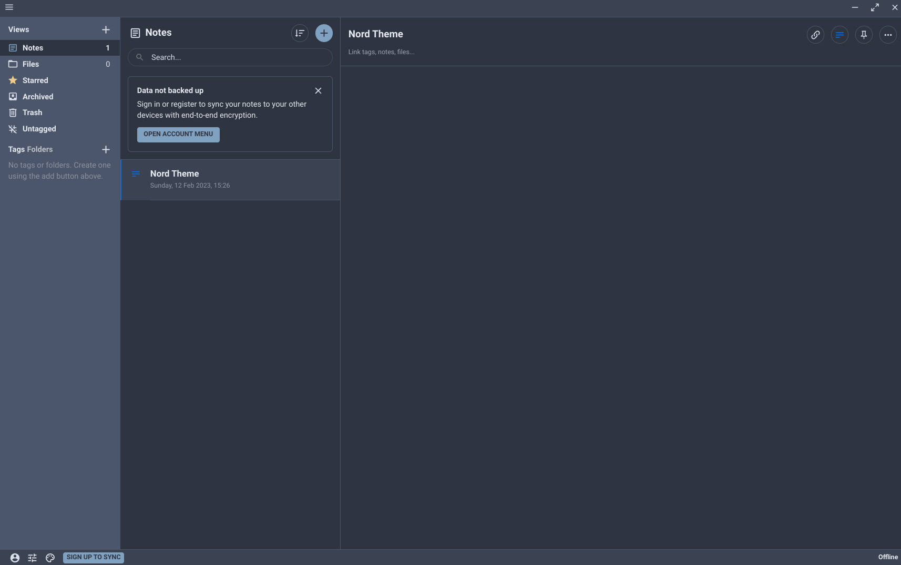

# Nord Theme for Standard Notes

This is a Nord-inspired theme for Standard Notes, a note-taking application.

## Installation

### Installing the Theme

To install the Nord theme, follow these steps:

1. Open Standard Notes and click on the **Slider Icon** located in the **lower-left corner** of the screen.
2. Select **"Open Preferences"** from the menu that appears.
3. In the left sidebar of the preferences window, click on the **"General"** tab.
4. Scroll to the bottom of the page and click on **"Advanced Settings"** to expand the options.
5. In the **"Install External Plugin"** section, paste the following URL into the field and click on "Install": `https://cdn.jsdelivr.net/gh/dombean/sn-theme-nord@latest/ext.json`

### Using the Theme

After installing the Nord theme, you can start using it by following these steps:

1. In Standard Notes, click on the **Pallete Icon** in the **lower-left corner** of the screen.
2. Choose **"Nord"** from the list of available themes under the **"Appearance"** section to apply it to your notes.

With these steps, you can easily install and use the Nord theme to customize the look and feel of your Standard Notes application.